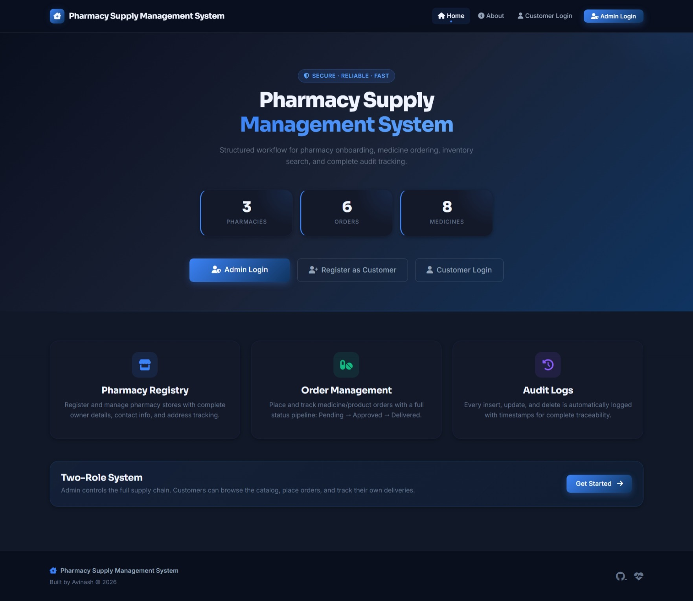

<div align="center">


<p>
  
  
  
  
  
</p>

<p>
  
  
  
  
  
  
  
</p>

<br/>

> **Originally built as a college DBMS Mini Project in 2024 — recently upgraded to a production-ready, fully deployed web application with Vercel + Neon PostgreSQL.**

<br/>

[🚀 Live Demo](https://pharmacy-supply-management-system.vercel.app) · [📖 Setup Guide](#-local-setup) · [🛠️ Features](#-features) · [🌐 Deploy](#-deployment)

### 🔑 Quick Demo Access

| Role | Username / Email | Password |
|---|---|---|
| **Admin** | `avi` | `avi@123` |
| **Customer** | `customer@example.com` | `Customer@123` |

</div>

---

## 📋 Table of Contents

- [✨ Overview](#-overview)
- [🎯 Features](#-features)
- [🏗️ Project Structure](#️-project-structure)
- [🛠️ Tech Stack](#️-tech-stack)
- [👥 User Roles](#-user-roles)
- [🗄️ Database Schema](#️-database-schema)
- [🚀 Local Setup](#-local-setup)
- [🌐 Deployment](#-deployment)
- [🔐 Security](#-security)
- [📸 Screenshots](#-screenshots)
- [👨💻 Developer](#-developer)

---

## ✨ Overview

The **Pharmacy Supply Management System** was originally built as a **college DBMS Mini Project in 2024** to demonstrate relational database concepts using Flask and SQLAlchemy.

It has since been **significantly upgraded in 2025** into a portfolio-ready, fully deployed web application — now live on **Vercel** with a **Neon PostgreSQL** backend — demonstrating role-based authentication, order lifecycle management, real-time analytics dashboards, autocomplete-powered order forms, and complete audit logging.

> 🔄 **What changed in the 2025 update:**
> - Migrated from local SQLite to Neon serverless PostgreSQL
> - Deployed live on Vercel (serverless)
> - Added customer portal with self-registration
> - Added Chart.js analytics dashboard
> - Added autocomplete for medicines & products in order forms
> - Added CSV export, print/PDF view, audit logs
> - Complete UI overhaul with dark navy theme (Sora + Inter fonts)
> - CSRF protection, session timeout, role-based guards

---

## 🎯 Features

### 🔑 Admin Features
| Feature | Description |
|---|---|
| 📊 **Analytics Dashboard** | KPI stat cards + Chart.js donut and bar charts |
| 🏪 **Pharmacy Management** | Full CRUD — register, edit, delete pharmacies |
| 💊 **Order Management** | Place, view, filter, update status, delete orders |
| 🔄 **Order Status Pipeline** | Pending → Approved → Delivered workflow |
| 🔍 **Inventory Search** | Search medicines/products with partial match |
| ➕ **Catalog Management** | Add and delete medicines/products from master list |
| 📋 **Audit Logs** | Filterable logs with CSV export for every action |
| 📈 **Reports Page** | Revenue analytics, top medicines, pharmacy breakdown |
| 📤 **CSV Export** | Export orders and logs as downloadable CSV files |
| 🖨️ **Print/PDF View** | Printable order report with branded layout |

### 👤 Customer Features
| Feature | Description |
|---|---|
| 📝 **Self Registration** | Customers register and login independently |
| 🛒 **Browse Catalog** | Searchable medicine and product catalog with autocomplete |
| 📦 **Place Orders** | Submit order requests with amount estimation |
| 👁️ **Track Own Orders** | View only their own orders, with status badges |
| ❌ **Cancel Orders** | Cancel any pending order before it's approved |
| 📤 **CSV Export** | Export personal order history as CSV |

### 🔒 Security Features
- ✅ Password hashing with `werkzeug.security`
- ✅ CSRF tokens on every form
- ✅ Session timeout (30 min inactivity)
- ✅ Role-based route protection (`@admin_required`, `@customer_required`)
- ✅ Server-side input validation on all forms
- ✅ SQLAlchemy ORM — no raw SQL queries

---

## 🏗️ Project Structure

```
pharmacy-supply-management/
│
├── api/
│   └── index.py                  # Vercel serverless entry point
│
├── app/                          # Application package
│   ├── __init__.py               # App factory (create_app)
│   ├── models.py                 # SQLAlchemy models
│   ├── utils.py                  # Helpers: decorators, validators, logger
│   ├── main_routes.py            # Public routes
│   ├── auth/routes.py            # Admin + customer auth
│   ├── pharmacy/routes.py        # Dashboard, CRUD
│   ├── orders/routes.py          # Order management
│   ├── inventory/routes.py       # Catalog management
│   ├── customer/routes.py        # Customer portal
│   └── reports/routes.py        # Analytics
│
├── templates/                    # Jinja2 HTML templates
├── static/                       # CSS + images
│
├── run.py                        # Local entry point
├── vercel.json                   # Vercel deployment config
├── requirements.txt              # Python dependencies
├── Procfile                      # Gunicorn config
└── .env.example                  # Environment variable template
```

---

## 🛠️ Tech Stack

| Layer | Technology |
|---|---|
| **Backend** | Python 3.13, Flask 3.1 |
| **ORM / Database** | Flask-SQLAlchemy, SQLAlchemy 2.0 |
| **Production DB** | PostgreSQL via Neon (serverless) |
| **Local DB** | SQLite (auto-fallback) |
| **Security** | Werkzeug password hashing, CSRF tokens |
| **Frontend** | Jinja2, Bootstrap 5.3, Font Awesome 6.5 |
| **Charts** | Chart.js (doughnut + bar) |
| **Hosting** | Vercel (serverless) |
| **Config** | python-dotenv |

---

## 👥 User Roles

```
┌─────────────────────────────────────────────────────────┐
│                    ADMIN (Store Owner)                  │
│  Dashboard · Pharmacies · Orders · Reports · Logs       │
└─────────────────────────────────────────────────────────┘

┌─────────────────────────────────────────────────────────┐
│                   CUSTOMER (Pharmacy)                   │
│  Register · Login · Catalog · My Orders · Cancel        │
└─────────────────────────────────────────────────────────┘
```

---

## 🗄️ Database Schema

```
posts            medicines           addmp          addpd
──────────       ─────────────────   ──────         ──────
mid (PK)         id (PK)             sno (PK)       sno (PK)
medical_name     mid (FK→posts)      medicine       product
owner_name       name
phone_no         medicines
address          products
                 email
                 amount
                 status
                 created_at

customers        customer_orders     logs
──────────────   ───────────────     ──────────
id (PK)          id (PK)             id (PK)
full_name        customer_id (FK)    mid
email (unique)   medicines           action
password_hash    products            date
created_at       amount
                 status
                 created_at
```

---

## 🚀 Local Setup

### 1. Clone the repository

```bash
git clone https://github.com/avinash2004avii-jpg/Pharmacy-Supply-Management-System.git
cd Pharmacy-Supply-Management-System
```

### 2. Create virtual environment

```bash
# Windows
python -m venv venv
venv\Scripts\activate

# macOS/Linux
python3 -m venv venv
source venv/bin/activate
```

### 3. Install dependencies

```bash
pip install -r requirements.txt
```

### 4. Configure environment

```bash
cp .env.example .env
```

Edit `.env`:

```env
SECRET_KEY=your-random-secret-key
ADMIN_USERNAME=avi
ADMIN_PASSWORD=avi@123
SEED_DATA=true
# Leave DATABASE_URL blank for local SQLite
```

### 5. Run the application

```bash
python run.py
```

Open **http://localhost:5000**

### Demo Credentials

| Role | Username / Email | Password |
|---|---|---|
| **Admin** | `avi` | `avi@123` |
| **Customer** | `customer@example.com` | `Customer@123` |

> 💡 These credentials work on the live demo too — feel free to explore!

---

## 🌐 Deployment

### Deploy to Vercel + Neon (Recommended — Free Forever)

#### Step 1 — Set up Neon Database
1. Go to [neon.tech](https://neon.tech) → Sign up free
2. Create a new project
3. Copy the connection string from dashboard

#### Step 2 — Push to GitHub
```bash
git init
git add .
git commit -m "initial commit"
git branch -M main
git remote add origin https://github.com/YOURUSERNAME/pharmacy-supply-management.git
git push -u origin main
```

#### Step 3 — Deploy on Vercel
1. Go to [vercel.com](https://vercel.com) → Sign up with GitHub
2. Click **Add New Project** → import your GitHub repo
3. Add these **Environment Variables**:

| Key | Value |
|---|---|
| `SECRET_KEY` | any-strong-random-string |
| `ADMIN_USERNAME` | avi |
| `ADMIN_PASSWORD` | avi@123 |
| `DATABASE_URL` | your Neon connection string |
| `SEED_DATA` | true |

4. Click **Deploy** ✅
5. Your app is live at `https://your-project.vercel.app` 🎉

> 💡 Every `git push` to `main` auto-redeploys on Vercel.

---

## 🔐 Security

| Measure | Implementation |
|---|---|
| Password Storage | `werkzeug.security.generate_password_hash` (PBKDF2-SHA256) |
| CSRF Protection | Custom token in session, validated on every POST |
| Session Timeout | Configurable inactivity timeout (default 30 min) |
| Route Protection | `@admin_required` and `@customer_required` decorators |
| Input Validation | Server-side checks on all forms |
| SQL Injection | SQLAlchemy ORM — no raw SQL queries |

---

## 📸 Screenshots

### 🖥️ Admin Dashboard
> Take a screenshot of your running app at `http://localhost:5000/dashboard` and save it as `static/img/screenshot-dashboard.png`, then it will appear here automatically.



> **To add your screenshot:**
> 1. Run the app locally — `python run.py`
> 2. Login as admin at `http://localhost:5000/login`
> 3. Press `F12` → take a screenshot or use Windows `Win + Shift + S`
> 4. Save as `static/img/screenshot-dashboard.png`
> 5. `git add . && git commit -m "add screenshot" && git push`

---

## 👨💻 Developer

<div align="center">

**Avinash**

[](https://github.com/avinash2004avii-jpg/)

*Originally a college DBMS Mini Project — 2024*
*Upgraded & deployed to production — 2026*
*Flask · PostgreSQL · Neon · Vercel · Bootstrap · Chart.js*

</div>

---

<div align="center">


**⭐ If this project helped you, consider giving it a star!**

</div>
